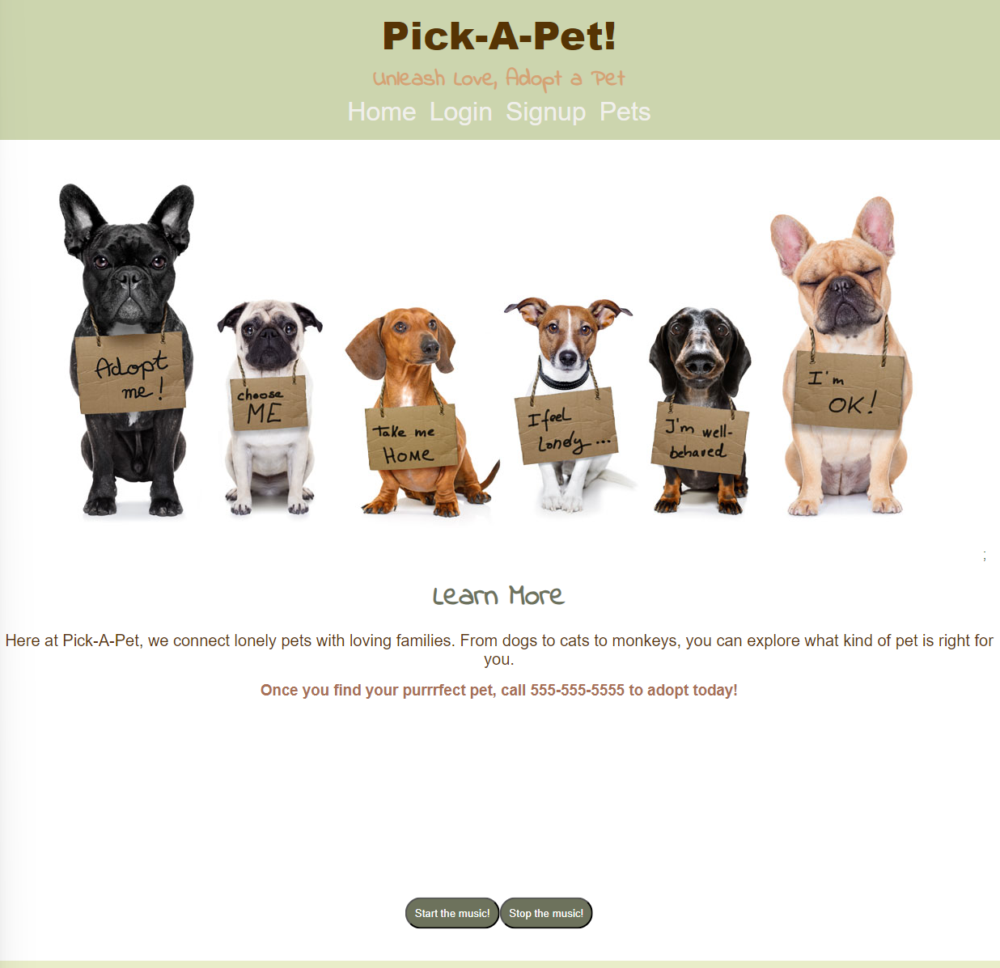
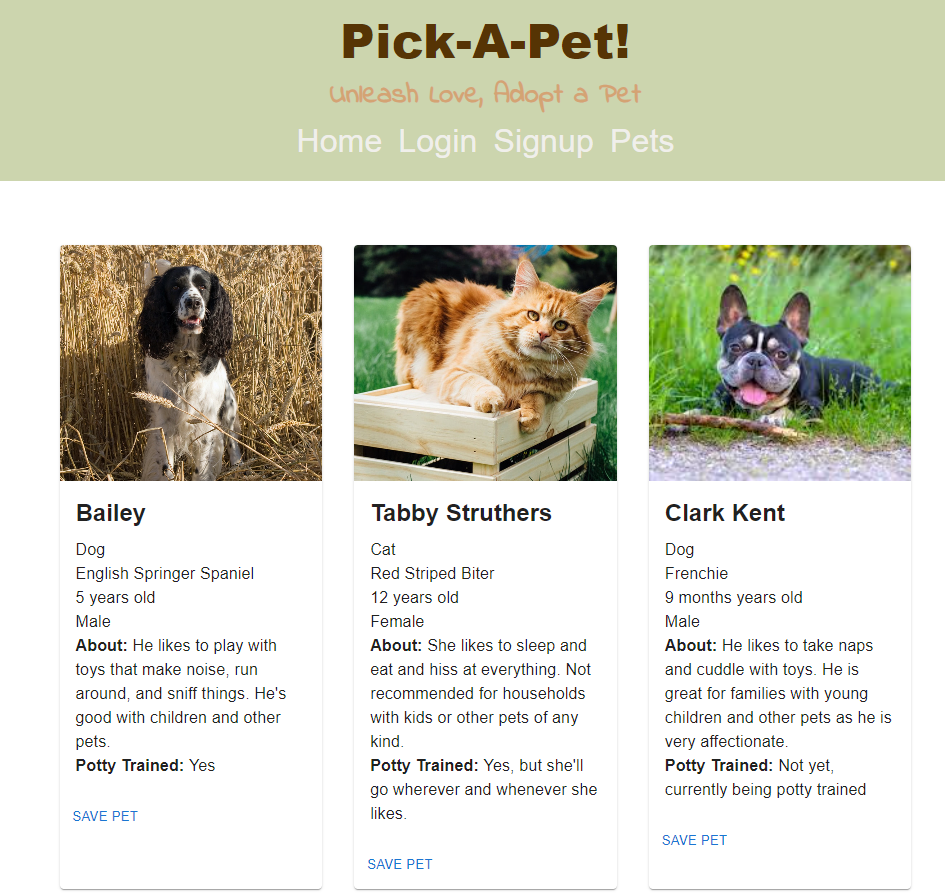

# Pick A Pet

## Description

An application to help a user find a pet to adopt. 

## Table of Contents

- [License](#license)
  
- [Wireframe](#wireframe)
- [Installation](#installation)
- [Usage](#usage)
- [Contributing](#contributing)
- [Tests](#tests)
- [Questions](#questions)

## License

This project is licensed under the None License. To learn more, see the [License](https://opensource.org/licenses/None).

## Previews

Homepage: 

PetsPage: 

## Installation

From Terminal, select commands of: npm i to install packages. Then enter npm run seed to populate database with seeds data. When seeding is finished, enter npm run develop to start server and open page.

## Usage

Once the site is open and active, the user can navigate between the Homepage and Pets pages. When a user interacts with the Home page, background music will play. There are buttons on the bottom of the page to start or stop the music if the user wishes. 

On the Pets page, the user can see pets that are available for adoption with the option to save the pet to a logged in user's profile.

The user can login if they have already signed up or the user can signup.

## Contributing

To Contribute: Github, Email
Contributors to our application code: Bootcamp TAs and Instructor, [kevinsmithwebdev](https://github.com/kevinsmithwebdev)

## Tests

No tests have been implemented other then error messaging.

## Questions

If you have any questions, feel free to reach out via the following platforms:

- GitHub profiles for developers:
    Rylee: github.com/Rylee94
    Ben: github.com/bennyleemn
    Halle: github.com/halleklum
- GitHub for Project Repo: [rylee94](https://github.com/Rylee94/pet-adoption)